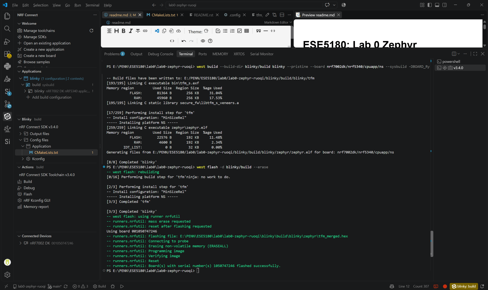
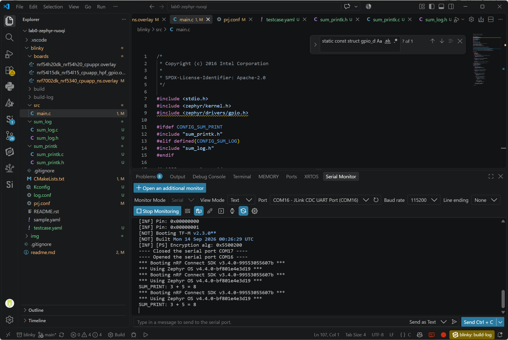
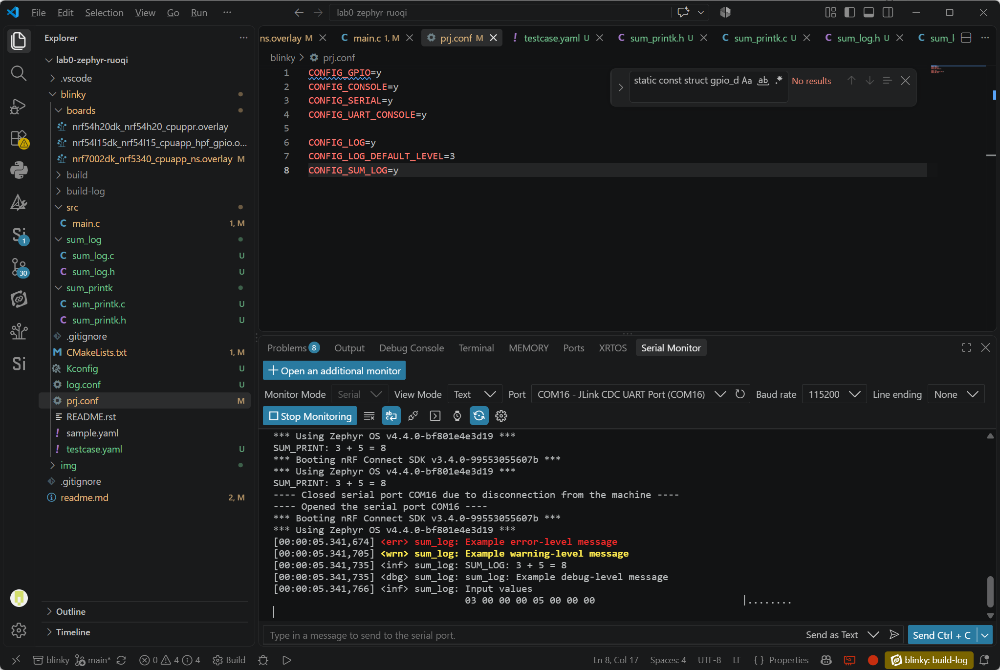
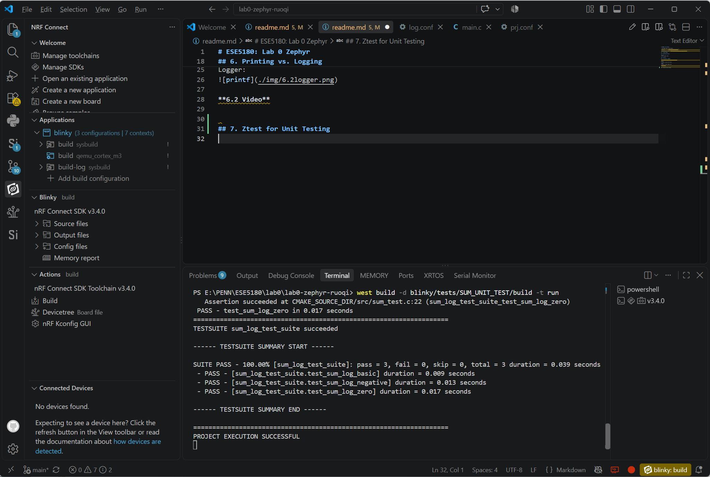
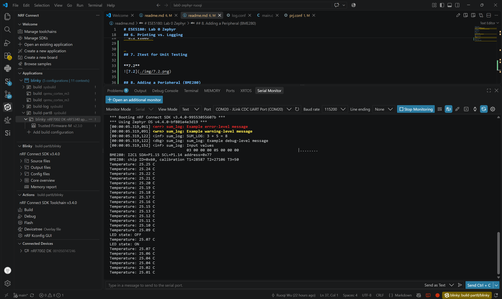
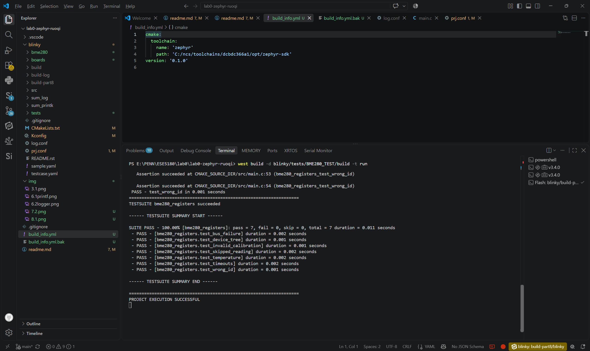

# ESE5180: Lab 0 Zephyr

| Team Member Name | Email Address                |
| ---------------- | ---------------------------- |
| Ruoqi Wu         | neorqi@engineering.upenn.edu |

**GitHub Repository URL:** https://github.com/RuoqiWu/lab0-zephyr-ruoqi.git

## 1. Hello (Vanilla) Zephyr

**1.1**

https://drive.google.com/file/d/1gXymkTVwwfpVirWrnWKb5uVIysRzoQiK/view?usp=sharing

## 2. Hello (Nordic) Zephyr

**2.1**

The standalone [Blinky implementation](blinky/lab_stages/src/main.c) uses the
original LED alias and a configurable delay between toggles. Its
[default configuration](blinky/lab_stages/prj.conf) sets the interval to 2000 ms.

**2.2**

https://drive.google.com/file/d/1aPX3zQiXPbE5lX6L41y7nZAuqLoV3YvA/view?usp=sharing

## 3. Building with West

**3.1**

## 4. Kconfig

## 5. Device Tree

**5.1** 

[board overlay](blinky/boards/nrf7002dk_nrf5340_cpuapp_ns.overlay)

**5.2** 

[button demonstration](blinky/lab_stages/src/main.c) polls the button every 20 ms and toggles LED2 on a released-to-pressed transition. It is selected by [part5.conf](blinky/lab_stages/part5.conf). The final application also retains button-controlled LED behavior in [main.c](blinky/src/main.c).

**5.3**

The same overlay maps `button5180` to `button0`. The program accesses the button through `DT_ALIA (button5180)` instead of hardcoding a pin number.

## 6. Printing vs. Logging

**6.1 Build and capture both implementations**

Printk:

Logger:

**6.2 Video**

https://drive.google.com/file/d/1Ls5lVdgIKuDd92Z1bBCNN8OaIIolVICq/view?usp=sharing

**6.3**
[main.c](blinky/src/main.c)

## 7. Ztest for Unit Testing

**7.1**  
[test source](blinky/tests/SUM_UNIT_TEST/src/sum_test.c)

**7.2**

## 8. Adding a Peripheral (BME280)

**8.1**

[BME280 code](blinky/bme280/README.md)

**8.2**

[mock-based tests](blinky/tests/BME280_TEST/src/main.c)

